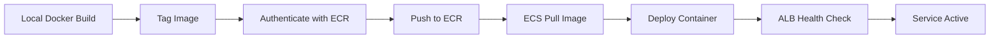

## Overview

The backend API runs as a Docker container on AWS ECS Fargate behind an Application Load Balancer. This section covers building the Docker image, pushing to ECR, and deploying to ECS.

### Deployment Architecture



## Build Docker Image

The backend uses a Python 3.11 slim base image with FastAPI and crawling dependencies.

### Review Dockerfile

The `backend/Dockerfile` contains:

```dockerfile
FROM python:3.11-slim

WORKDIR /app

# Install system dependencies
RUN apt-get update && apt-get install -y --no-install-recommends \
    curl \
    && rm -rf /var/lib/apt/lists/*

# Install Python dependencies
COPY requirements.txt .
RUN pip install --no-cache-dir -r requirements.txt

# Copy application code
COPY . .

EXPOSE 8000

# Run FastAPI server
CMD ["uvicorn", "main:app", "--host", "0.0.0.0", "--port", "8000"]
```

<Note>
  The container exposes port 8000 for the FastAPI application.
</Note>

### Build the Image

Navigate to backend directory and build:

```bash
cd backend
docker build -t llmstxt-api:latest .
```

Expected output:
```
[+] Building 45.2s (11/11) FINISHED
 => [internal] load build definition from Dockerfile
 => => transferring dockerfile: 350B
 => [internal] load .dockerignore
 => [1/6] FROM docker.io/library/python:3.11-slim
 => [2/6] WORKDIR /app
 => [3/6] RUN apt-get update && apt-get install -y curl
 => [4/6] COPY requirements.txt .
 => [5/6] RUN pip install --no-cache-dir -r requirements.txt
 => [6/6] COPY . .
 => exporting to image
 => => writing image sha256:abc123...
 => => naming to docker.io/library/llmstxt-api:latest
```

<Check>
  Docker image built successfully! Image size should be around 500-700MB.
</Check>

### Test Image Locally (Optional)

<Accordion title="Run container locally to verify">
  Test the built image before pushing to ECR:

  ```bash
  # Create .env file with test credentials
  cat > .env <<EOF
  SUPABASE_URL=https://your-project.supabase.co
  SUPABASE_KEY=your-key
  R2_ENDPOINT=https://your-endpoint.r2.cloudflarestorage.com
  R2_ACCESS_KEY=your-access-key
  R2_SECRET_KEY=your-secret-key
  R2_BUCKET=llmstxt
  R2_PUBLIC_DOMAIN=https://pub-xxxxx.r2.dev
  CORS_ORIGINS=*
  API_KEY=test-key
  CRON_SECRET=test-secret
  EOF

  # Run container
  docker run -p 8000:8000 --env-file .env llmstxt-api:latest
  ```

  Test the health endpoint:
  ```bash
  curl http://localhost:8000/health
  # Expected: {"status":"ok"}
  ```

  Stop the container with `Ctrl+C`.
</Accordion>

## Push Image to Amazon ECR

### Get ECR Repository URL

Retrieve the ECR repository URL from Terraform:

```bash
cd ../terraform
terraform output ecr_repository_url
```

Example output:
```
123456789012.dkr.ecr.us-east-1.amazonaws.com/llmstxt-api
```

Save this as an environment variable:
```bash
export ECR_REPO=$(terraform output -raw ecr_repository_url)
echo $ECR_REPO
```

### Authenticate Docker with ECR

Log in to ECR using AWS CLI:

```bash
aws ecr get-login-password --region us-east-1 | \
  docker login --username AWS --password-stdin \
  $ECR_REPO
```

Expected output:
```
Login Succeeded
```

<Warning>
  ECR authentication tokens expire after 12 hours. Re-run this command if you get authentication errors.
</Warning>

### Tag Image for ECR

Tag the local image with the ECR repository URL:

```bash
cd ../backend
docker tag llmstxt-api:latest $ECR_REPO:latest
```

Verify the tag:
```bash
docker images | grep llmstxt-api
```

You should see both tags:
```
llmstxt-api                                    latest    abc123...  5 minutes ago  650MB
123456789012.dkr.ecr.us-east-1.amazonaws.com/llmstxt-api   latest    abc123...  5 minutes ago  650MB
```

### Push Image to ECR

Push the tagged image to ECR:

```bash
docker push $ECR_REPO:latest
```

Expected output:
```
The push refers to repository [123456789012.dkr.ecr.us-east-1.amazonaws.com/llmstxt-api]
5f70bf18a086: Pushed
6e62e7c2e5a5: Pushed
3abc4def5678: Pushed
...
latest: digest: sha256:1234567890abcdef... size: 2345
```

This takes 2-5 minutes depending on your internet connection.

<Check>
  Image successfully pushed to ECR!
</Check>

## Deploy to ECS

### Force New Deployment

Trigger ECS to pull the new image and deploy:

```bash
aws ecs update-service \
  --cluster llmstxt-cluster \
  --service llmstxt-api-service \
  --force-new-deployment \
  --region us-east-1
```

Expected output:
```json
{
    "service": {
        "serviceName": "llmstxt-api-service",
        "clusterArn": "arn:aws:ecs:us-east-1:...:cluster/llmstxt-cluster",
        "deployments": [
            {
                "status": "PRIMARY",
                "desiredCount": 1,
                "runningCount": 0
            }
        ]
    }
}
```

### Monitor Deployment Progress

Watch the deployment status:

```bash
watch -n 5 'aws ecs describe-services \
  --cluster llmstxt-cluster \
  --services llmstxt-api-service \
  --query "services[0].deployments" \
  --region us-east-1'
```

<Note>
  Press `Ctrl+C` to stop watching. Deployment typically takes 3-5 minutes.
</Note>

Look for:
- **Running count**: Should increase from 0 to 1
- **Desired count**: Should be 1
- **Status**: Should be "PRIMARY"

### Check Task Status

Verify the ECS task is running:

```bash
aws ecs list-tasks \
  --cluster llmstxt-cluster \
  --service-name llmstxt-api-service \
  --region us-east-1
```

Expected output:
```json
{
    "taskArns": [
        "arn:aws:ecs:us-east-1:...:task/llmstxt-cluster/abc123def456"
    ]
}
```

<Check>
  If you see a task ARN, the container is running!
</Check>

### View Task Details

Get detailed task information:

```bash
# Get task ARN
TASK_ARN=$(aws ecs list-tasks \
  --cluster llmstxt-cluster \
  --service-name llmstxt-api-service \
  --query 'taskArns[0]' \
  --output text \
  --region us-east-1)

# Describe task
aws ecs describe-tasks \
  --cluster llmstxt-cluster \
  --tasks $TASK_ARN \
  --region us-east-1
```

Check `lastStatus`: should be `RUNNING`.

## Verify Deployment

### Get Load Balancer URL

```bash
cd ../terraform
terraform output alb_dns_name
```

Example output:
```
llmstxt-alb-1234567890.us-east-1.elb.amazonaws.com
```

### Test Health Endpoint

Wait 30-60 seconds for the ALB health check to pass, then test:

```bash
curl http://$(terraform output -raw alb_dns_name)/health
```

Expected response:
```json
{"status":"ok"}
```

<Check>
  Backend API is live and healthy!
</Check>

### Test WebSocket Endpoint

<Accordion title="Test WebSocket connection (optional)">
  Install `websocat` for WebSocket testing:

  ```bash
  # macOS
  brew install websocat

  # Linux
  wget https://github.com/vi/websocat/releases/latest/download/websocat_linux64
  chmod +x websocat_linux64
  sudo mv websocat_linux64 /usr/local/bin/websocat
  ```

  Test crawl endpoint:
  ```bash
  ALB_URL=$(cd terraform && terraform output -raw alb_dns_name)
  API_KEY="your-api-key-from-terraform-tfvars"

  echo '{"url":"https://example.com","maxPages":5,"descLength":200}' | \
    websocat "ws://${ALB_URL}/ws/crawl?api_key=${API_KEY}"
  ```

  You should see streaming crawl progress messages.
</Accordion>

## View Container Logs

### Via AWS CLI

View recent application logs:

```bash
aws logs tail /ecs/llmstxt-api \
  --follow \
  --region us-east-1
```

### Via AWS Console

1. Go to [CloudWatch Console](https://console.aws.amazon.com/cloudwatch/)
2. Navigate to **Logs** → **Log groups**
3. Open `/ecs/llmstxt-api`
4. View log streams (one per task/container)

### Check for Errors

Search logs for error messages:

```bash
aws logs filter-log-events \
  --log-group-name /ecs/llmstxt-api \
  --filter-pattern "ERROR" \
  --region us-east-1
```

## Updating the Application

To deploy code changes:

<Steps>
  <Step title="Make Code Changes">
    Edit backend code in `backend/` directory.
  </Step>
  
  <Step title="Rebuild Docker Image">
    ```bash
    cd backend
    docker build -t llmstxt-api:latest .
    ```
  </Step>
  
  <Step title="Tag and Push to ECR">
    ```bash
    docker tag llmstxt-api:latest $ECR_REPO:latest
    docker push $ECR_REPO:latest
    ```
  </Step>
  
  <Step title="Force ECS Deployment">
    ```bash
    aws ecs update-service \
      --cluster llmstxt-cluster \
      --service llmstxt-api-service \
      --force-new-deployment \
      --region us-east-1
    ```
  </Step>
  
  <Step title="Monitor Deployment">
    Watch deployment progress and verify health endpoint.
  </Step>
</Steps>

<Note>
  ECS performs a rolling deployment: new task starts before old task stops (zero downtime).
</Note>

## Troubleshooting

<AccordionGroup>
  <Accordion title="Task fails to start">
    **Check task stopped reason**:
    ```bash
    aws ecs describe-tasks \
      --cluster llmstxt-cluster \
      --tasks $TASK_ARN \
      --query 'tasks[0].stoppedReason'
    ```

    Common issues:
    - **Image pull error**: Verify ECR authentication
    - **Task execution role**: Check IAM permissions
    - **Environment variables**: Verify Terraform configuration
  </Accordion>

  <Accordion title="Health check failing">
    **Check ALB target health**:
    ```bash
    aws elbv2 describe-target-health \
      --target-group-arn $(cd terraform && terraform output -raw target_group_arn)
    ```

    If unhealthy:
    1. Verify container is listening on port 8000
    2. Check security group allows ALB → ECS traffic
    3. Review container logs for startup errors
  </Accordion>

  <Accordion title="Cannot access ALB">
    **Verify security group**:
    ```bash
    aws ec2 describe-security-groups \
      --filters "Name=tag:Name,Values=llmstxt-alb-sg" \
      --query 'SecurityGroups[0].IpPermissions'
    ```

    Ensure port 80 and 443 are open to 0.0.0.0/0.
  </Accordion>

  <Accordion title="Out of memory errors">
    **Increase task memory**:
    
    Edit `terraform/ecs.tf`:
    ```hcl
    resource "aws_ecs_task_definition" "llmstxt_api" {
      # ...
      memory = "2048"  # Increase from 1024 to 2048 (2GB)
    }
    ```

    Apply changes:
    ```bash
    cd terraform
    terraform apply
    ```
  </Accordion>
</AccordionGroup>

## Scaling Configuration

### Manual Scaling

Increase the number of running tasks:

```bash
aws ecs update-service \
  --cluster llmstxt-cluster \
  --service llmstxt-api-service \
  --desired-count 2 \
  --region us-east-1
```

### Auto Scaling (Optional)

<Accordion title="Configure ECS Auto Scaling based on CPU">
  Add to `terraform/ecs.tf`:

  ```hcl
  resource "aws_appautoscaling_target" "ecs_target" {
    max_capacity       = 4
    min_capacity       = 1
    resource_id        = "service/${aws_ecs_cluster.llmstxt.name}/${aws_ecs_service.llmstxt_api.name}"
    scalable_dimension = "ecs:service:DesiredCount"
    service_namespace  = "ecs"
  }

  resource "aws_appautoscaling_policy" "ecs_cpu_scaling" {
    name               = "llmstxt-cpu-scaling"
    policy_type        = "TargetTrackingScaling"
    resource_id        = aws_appautoscaling_target.ecs_target.resource_id
    scalable_dimension = aws_appautoscaling_target.ecs_target.scalable_dimension
    service_namespace  = aws_appautoscaling_target.ecs_target.service_namespace

    target_tracking_scaling_policy_configuration {
      target_value       = 70.0
      predefined_metric_specification {
        predefined_metric_type = "ECSServiceAverageCPUUtilization"
      }
    }
  }
  ```

  Apply with `terraform apply`.
</Accordion>

## Next Steps

<Card title="Frontend Deployment" icon="browser" href="/deployment/frontend">
  Deploy the Next.js frontend to Vercel
</Card>