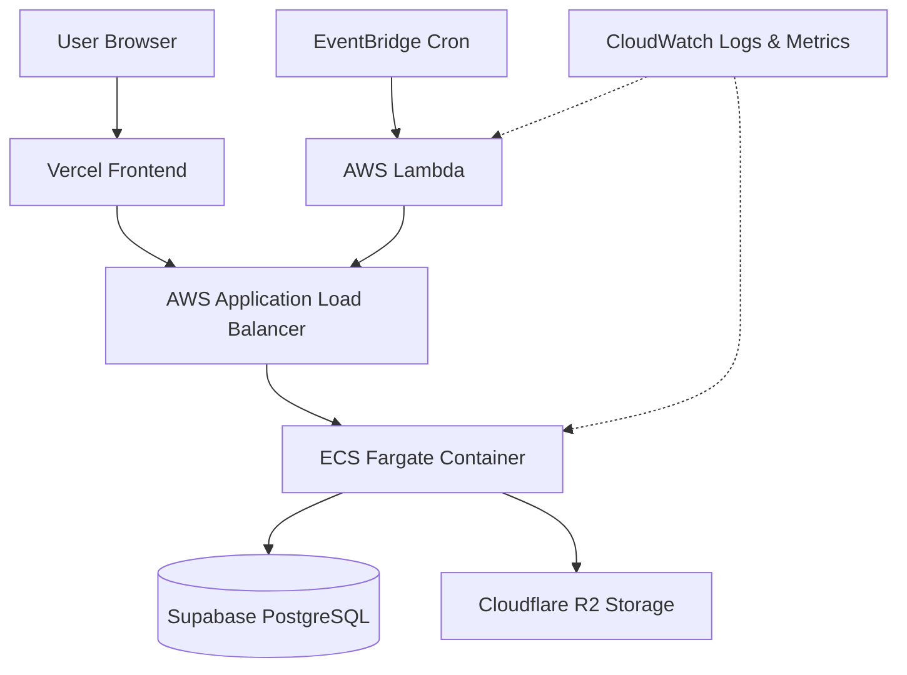

## Architecture Overview

The llms.txt Generator uses a modern serverless and containerized architecture deployed on AWS, with managed services for database and storage.

### Key Components

<CardGroup cols={2}>
  <Card title="Backend API" icon="server">
    FastAPI application running on ECS Fargate behind an Application Load Balancer
  </Card>
  <Card title="Database" icon="database">
    Supabase PostgreSQL for tracking crawl sites and metadata
  </Card>
  <Card title="Storage" icon="cloud">
    Cloudflare R2 for storing generated llms.txt files
  </Card>
  <Card title="Frontend" icon="browser">
    Next.js application deployed on Vercel
  </Card>
</CardGroup>

### Architecture Diagram

## Infrastructure Components

### AWS Resources

<AccordionGroup>
  <Accordion title="Compute (ECS Fargate)">
    - **ECS Cluster**: Container orchestration
    - **Task Definition**: 0.5 vCPU, 1GB RAM
    - **Service**: 1 running task with auto-healing
    - **ECR Repository**: Docker image registry
  </Accordion>

  <Accordion title="Networking">
    - **Application Load Balancer**: Routes HTTP/HTTPS traffic
    - **Target Group**: Health checks on `/health` endpoint
    - **Security Groups**: ALB (80/443) → ECS Tasks (8000)
    - **VPC & Subnets**: Requires 2+ subnets in different AZs
  </Accordion>

  <Accordion title="Automation">
    - **Lambda Function**: Triggers recrawl endpoint
    - **EventBridge Rule**: Cron schedule (every 6 hours)
    - **S3 Bucket**: Lambda deployment package storage
  </Accordion>

  <Accordion title="Monitoring">
    - **CloudWatch Logs**: Application and Lambda logs (14-day retention)
    - **CloudWatch Metrics**: CPU, Memory, Response Time
    - **CloudWatch Alarms**: 10 alarms for critical metrics
    - **SNS Topic**: Email alerts for incidents
  </Accordion>

  <Accordion title="Security">
    - **IAM Roles**: Least-privilege access for ECS and Lambda
    - **ACM Certificate**: SSL/TLS for HTTPS
    - **Secrets**: Environment variables in task definitions
  </Accordion>
</AccordionGroup>

### External Services

<CardGroup cols={2}>
  <Card title="Supabase" icon="database">
    - PostgreSQL database
    - Free tier supported
    - Stores site metadata and crawl history
  </Card>
  <Card title="Cloudflare R2" icon="cloud">
    - S3-compatible object storage
    - Public URL access
    - Stores generated llms.txt files
  </Card>
  <Card title="Vercel" icon="bolt">
    - Frontend hosting
    - Automatic deployments from Git
    - Edge network CDN
  </Card>
  <Card title="Brightdata (Optional)" icon="globe">
    - JavaScript-heavy site scraping
    - Scraping Browser API
    - Pay-per-use pricing
  </Card>
</CardGroup>

## Deployment Flow

<Steps>
  <Step title="Prerequisites Setup">
    Install required tools (AWS CLI, Terraform, Docker) and create accounts (AWS, Supabase, Cloudflare)
  </Step>
  
  <Step title="AWS Configuration">
    Configure AWS CLI and identify VPC/subnet resources for ECS deployment
  </Step>
  
  <Step title="Database & Storage">
    Set up Supabase database with migrations and configure Cloudflare R2 bucket
  </Step>
  
  <Step title="Terraform Variables">
    Configure terraform.tfvars with all service credentials and settings
  </Step>
  
  <Step title="Infrastructure Deployment">
    Run terraform apply to create all AWS resources (ECR, ECS, ALB, Lambda, monitoring)
  </Step>
  
  <Step title="Docker Build & Deploy">
    Build Docker image, push to ECR, and deploy to ECS
  </Step>
  
  <Step title="Frontend Deployment">
    Deploy Next.js frontend to Vercel with backend API URL
  </Step>
  
  <Step title="DNS & SSL">
    Configure custom domain and SSL certificate (optional)
  </Step>
</Steps>

## Resource Requirements

### Compute Resources

| Component | Specification | Cost Estimate |
|-----------|--------------|---------------|
| ECS Fargate Task | 0.5 vCPU, 1GB RAM | ~$15/month |
| Application Load Balancer | Standard ALB | ~$16/month |
| Lambda Function | 512MB, runs every 6 hours | Less than $1/month |
| CloudWatch Logs | 14-day retention | ~$2/month |

<Note>
  Total AWS infrastructure costs: approximately **$35-40/month** for production deployment.
</Note>

### External Services

- **Supabase**: Free tier (500MB database, 1GB storage)
- **Cloudflare R2**: Free tier (10GB storage, 1M Class A operations)
- **Vercel**: Free tier (100GB bandwidth)
- **Brightdata**: Pay-per-use (optional, ~$0.001 per page)

## Deployment Time

Expected time to complete full deployment:

- **Prerequisites & Account Setup**: 30-60 minutes (one-time)
- **Terraform Infrastructure**: 5-10 minutes
- **Docker Build & Push**: 5-10 minutes
- **ECS Service Deployment**: 3-5 minutes
- **Frontend Deployment**: 2-3 minutes

<Warning>
  First-time deployments may take longer due to account setup, DNS propagation, and SSL certificate validation.
</Warning>

## Next Steps

<CardGroup cols={2}>
  <Card title="Prerequisites" icon="list-check" href="/deployment/prerequisites">
    Install required tools and create service accounts
  </Card>
  <Card title="AWS Setup" icon="aws" href="/deployment/aws-setup">
    Configure AWS CLI and identify network resources
  </Card>
  <Card title="Database & Storage" icon="database" href="/deployment/database-storage">
    Set up Supabase and Cloudflare R2
  </Card>
  <Card title="Terraform Deployment" icon="code" href="/deployment/terraform">
    Deploy infrastructure with Terraform
  </Card>
</CardGroup>