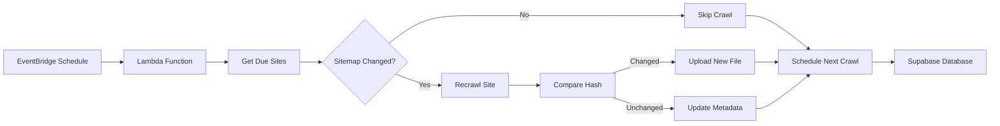

## Overview

The llms.txt Generator supports automatic updates to keep your generated files synchronized with website changes. When enabled, sites are enrolled in a scheduled recrawl system that monitors for changes and regenerates content automatically.

<Info>
  Auto-updates run on AWS Lambda triggered by EventBridge (CloudWatch Events) every 6 hours by default.
</Info>

## Architecture



## How It Works

<Steps>
  <Step title="Enrollment">
    When a user enables auto-update during crawl, the site is enrolled:

    ```python backend/main.py
    enable_auto_update = payload.get('enableAutoUpdate', False)
    recrawl_interval = payload.get('recrawlIntervalMinutes', 10080)

    if enable_auto_update:
        llms_hash = hashlib.sha256(llms_txt.encode()).hexdigest()

        # Detect sentinel URL (sitemap)
        sentinel_url = None
        async with httpx.AsyncClient(timeout=5.0) as client:
            for path in ['/sitemap.xml', '/sitemap_index.xml']:
                try:
                    resp = await client.head(f"{url}{path}")
                    if resp.status_code == 200:
                        sentinel_url = f"{url}{path}"
                        break
                except:
                    continue

        await save_site_metadata(
            base_url=url,
            recrawl_interval_minutes=recrawl_interval,
            max_pages=max_pages,
            desc_length=desc_length,
            latest_llms_hash=llms_hash,
            latest_llms_url=hosted_url,
            sentinel_url=sentinel_url
        )
        await log("Auto-update enabled for this site")
    ```
  </Step>

  <Step title="Scheduled Trigger">
    Lambda function is invoked by EventBridge on a schedule:

    ```python backend/recrawl.py
    async def recrawl_due_sites() -> dict:
        sites = await get_due_sites()
        results = {
            "total": len(sites),
            "processed": 0,
            "updated": 0,
            "unchanged": 0,
            "errors": 0
        }
        now = datetime.now(timezone.utc)

        for site in sites:
            # Process each site...
    ```
  </Step>

  <Step title="Sitemap Change Detection">
    Before crawling, check if the sitemap has changed:

    ```python backend/recrawl.py
    sitemap_has_changed = True
    newest_lastmod = None

    if site.sentinel_url and (site.sentinel_url.endswith('.xml') or 'sitemap' in site.sentinel_url):
        try:
            sitemap_has_changed, newest_lastmod = await has_sitemap_changed(
                site.sentinel_url,
                site.last_changed_at or site.last_crawled_at
            )

            if not sitemap_has_changed:
                print(f"Sitemap unchanged for {site.base_url}, skipping crawl")

                next_crawl_at, _, _ = compute_next_crawl(
                    site.recrawl_interval_minutes,
                    site.avg_change_interval_minutes,
                    content_changed=False,
                    last_changed_at=site.last_changed_at,
                    now=now,
                    adaptive_enabled=False
                )

                await update_scheduling_only(site.id, next_crawl_at, newest_lastmod)
                results["unchanged"] += 1
                continue
        except Exception as e:
            print(f"Error checking sitemap for {site.base_url}: {e}")
    ```
  </Step>

  <Step title="Recrawl & Compare">
    If sitemap changed (or no sitemap), perform full crawl and compare hash:

    ```python backend/recrawl.py
    crawler = LLMCrawler(
        site.base_url,
        site.max_pages,
        site.desc_length,
        no_op_log,
        brightdata_api_key=settings.brightdata_api_key,
        brightdata_enabled=settings.brightdata_enabled,
        brightdata_zone=settings.brightdata_zone,
        brightdata_password=settings.brightdata_password
    )
    pages = await crawler.run()

    # Format and optionally enhance
    md_url_map = await get_md_url_map(pages)
    llms_txt = format_llms_txt(site.base_url, pages, md_url_map)

    if settings.llm_enhancement_enabled:
        # Apply LLM enhancement...

    # Compare hash
    new_hash = hashlib.sha256(llms_txt.encode()).hexdigest()
    content_changed = (new_hash != site.latest_llms_hash)
    ```
  </Step>

  <Step title="Update Storage">
    If content changed, upload new file and update database:

    ```python backend/recrawl.py
    if content_changed:
        hosted_url = await save_llms_txt(site.base_url, llms_txt, no_op_log)
        if hosted_url:
            results["updated"] += 1
        else:
            hosted_url = site.latest_llms_url or ""
            results["errors"] += 1
    else:
        hosted_url = site.latest_llms_url or ""

    await update_crawl_result(
        site.id,
        new_hash,
        hosted_url,
        next_crawl_at,
        new_last_changed,
        newest_lastmod,
        new_avg_interval
    )

    results["processed"] += 1
    ```
  </Step>

  <Step title="Schedule Next Crawl">
    Calculate next crawl time based on interval:

    ```python backend/scheduling.py
    def compute_next_crawl(
        site_recrawl_interval: int,
        avg_change_interval: float | None,
        content_changed: bool,
        last_changed_at: datetime | None,
        now: datetime,
        adaptive_enabled: bool = False
    ) -> tuple[datetime, float | None, datetime | None]:
        if not adaptive_enabled:
            interval_minutes = site_recrawl_interval
            return (
                now + timedelta(minutes=interval_minutes),
                avg_change_interval,
                last_changed_at if not content_changed else now
            )

        # Adaptive scheduling logic (optional)...
    ```
  </Step>
</Steps>

## Sitemap Change Detection

To avoid unnecessary crawls, the system checks sitemap `<lastmod>` timestamps:

```python backend/sitemap_utils.py
async def has_sitemap_changed(
    sitemap_url: str, 
    last_check_time: datetime | None
) -> tuple[bool, datetime | None]:
    sitemap_info = await parse_sitemap(sitemap_url)

    if not sitemap_info:
        return (True, None)  # Can't parse - assume changed

    if not sitemap_info.newest_lastmod:
        return (True, None)  # No timestamp - assume changed

    if not last_check_time:
        return (True, sitemap_info.newest_lastmod)  # First check

    # Compare timestamps
    newest = sitemap_info.newest_lastmod
    last_check = last_check_time

    if newest.tzinfo:
        newest = newest.replace(tzinfo=None)
    if last_check.tzinfo:
        last_check = last_check.replace(tzinfo=None)

    has_changed = newest > last_check

    return (has_changed, sitemap_info.newest_lastmod)
```

<Info>
  **Performance benefit**: Sites with unchanged sitemaps skip the expensive crawl operation entirely, saving time and costs.
</Info>

## Configuration

### Enable During Crawl

Pass auto-update parameters in WebSocket request:

```javascript
ws.send(JSON.stringify({
  url: 'https://example.com',
  maxPages: 50,
  descLength: 500,
  enableAutoUpdate: true,
  recrawlIntervalMinutes: 10080  // 7 days
}));
```

<ParamField path="enableAutoUpdate" type="boolean" default="false">
  Enable scheduled recrawls for this site
</ParamField>

<ParamField path="recrawlIntervalMinutes" type="integer" default="10080">
  Minutes between recrawls. Common values:
  - `360` = 6 hours
  - `1440` = 1 day
  - `10080` = 7 days (default)
  - `43200` = 30 days
</ParamField>

### Lambda Trigger Setup

The Lambda function is triggered via EventBridge:

```python backend/main.py
@app.post("/internal/cron/recrawl")
async def trigger_recrawl(
    background_tasks: BackgroundTasks, 
    x_cron_secret: str = Header(None)
):
    if not settings.cron_secret or x_cron_secret != settings.cron_secret:
        raise HTTPException(status_code=401, detail="Unauthorized")

    background_tasks.add_task(run_recrawl_in_background)
    return {"status": "triggered", "message": "Recrawl started in background"}

async def run_recrawl_in_background():
    try:
        print("[RECRAWL] Starting background recrawl...")
        results = await recrawl_due_sites()
        print(f"[RECRAWL] Completed: {results}")
    except Exception as e:
        print(f"[RECRAWL] Error: {e}")
```

**EventBridge Rule:**
```json
{
  "schedule": "rate(6 hours)",
  "targets": [
    {
      "arn": "arn:aws:lambda:us-east-1:123456789:function:llmstxt-recrawl",
      "input": {
        "httpMethod": "POST",
        "path": "/internal/cron/recrawl",
        "headers": {
          "X-Cron-Secret": "your_cron_secret"
        }
      }
    }
  ]
}
```

## Webhook Trigger

For immediate updates when content changes, use webhook triggers:

```python backend/main.py
@app.post("/internal/hooks/site-changed")
async def trigger_site_recrawl(
    request: Request,
    base_url: str = Body(...),
    webhook_secret: str = Body(None)
):
    try:
        client = get_supabase_client()
        if not client:
            raise HTTPException(status_code=503, detail="Database unavailable")

        result = client.table("crawl_sites") \
            .select("*") \
            .eq("base_url", base_url) \
            .execute()

        if not result.data:
            raise HTTPException(status_code=404, detail="Site not enrolled")

        site = result.data[0]

        if site.get("webhook_secret") and webhook_secret != site.get("webhook_secret"):
            raise HTTPException(status_code=401, detail="Invalid webhook secret")

        # Schedule immediate recrawl
        now = datetime.now(timezone.utc)
        client.table("crawl_sites").update({
            "next_crawl_at": now.isoformat(),
            "updated_at": now.isoformat()
        }).eq("base_url", base_url).execute()

        return {
            "status": "scheduled", 
            "base_url": base_url, 
            "next_crawl_at": now.isoformat()
        }

    except HTTPException:
        raise
    except Exception as e:
        raise HTTPException(status_code=500, detail=str(e))
```

### Webhook Usage

Trigger recrawl from your CI/CD pipeline:

```bash
curl -X POST https://api.llmstxt.cloud/internal/hooks/site-changed \
  -H "Content-Type: application/json" \
  -d '{
    "base_url": "https://example.com",
    "webhook_secret": "your_webhook_secret"
  }'
```

<Info>
  This is useful for documentation sites that want to update llms.txt immediately after deploying new content.
</Info>

## Database Schema

Site metadata is stored in Supabase:

```sql
CREATE TABLE crawl_sites (
    id UUID PRIMARY KEY DEFAULT gen_random_uuid(),
    base_url TEXT UNIQUE NOT NULL,
    max_pages INTEGER DEFAULT 50,
    desc_length INTEGER DEFAULT 500,
    recrawl_interval_minutes INTEGER DEFAULT 10080,
    
    -- Crawl results
    last_crawled_at TIMESTAMP WITH TIME ZONE,
    last_changed_at TIMESTAMP WITH TIME ZONE,
    latest_llms_hash TEXT,
    latest_llms_url TEXT,
    
    -- Change detection
    sentinel_url TEXT,
    sentinel_last_modified TIMESTAMP WITH TIME ZONE,
    avg_change_interval_minutes FLOAT,
    
    -- Scheduling
    next_crawl_at TIMESTAMP WITH TIME ZONE,
    
    -- Metadata
    created_at TIMESTAMP WITH TIME ZONE DEFAULT NOW(),
    updated_at TIMESTAMP WITH TIME ZONE DEFAULT NOW()
);

CREATE INDEX idx_next_crawl ON crawl_sites (next_crawl_at)
  WHERE next_crawl_at IS NOT NULL;
```

## Recrawl Results

The Lambda function returns summary statistics:

```python
results = {
    "total": 25,          # Sites checked
    "processed": 20,     # Sites crawled
    "updated": 8,        # Content changed
    "unchanged": 5,      # Sitemap unchanged (skipped)
    "errors": 2          # Failed crawls
}
```

**CloudWatch Logs:**
```
[RECRAWL] Starting background recrawl...
Sitemap unchanged for https://example.com, skipping crawl
Sitemap shows changes for https://docs.example.com, performing full crawl
Crawl complete: 47 pages
Content hash changed, uploading new version
Upload complete: https://pub-abc123.r2.dev/docs.example.com/llms.txt
[RECRAWL] Completed: {'total': 25, 'processed': 20, 'updated': 8, 'unchanged': 5, 'errors': 2}
```

## Adaptive Scheduling (Future)

The system includes scaffolding for adaptive scheduling based on observed change frequency:

```python backend/scheduling.py
MIN_INTERVAL_MINUTES = 60        # 1 hour minimum
MAX_INTERVAL_MINUTES = 10080     # 7 days maximum
EWMA_ALPHA = 0.5                 # Moderate adaptation rate

def compute_next_crawl(
    site_recrawl_interval: int,
    avg_change_interval: float | None,
    content_changed: bool,
    last_changed_at: datetime | None,
    now: datetime,
    adaptive_enabled: bool = False
) -> tuple[datetime, float | None, datetime | None]:
    if not adaptive_enabled:
        interval_minutes = site_recrawl_interval
        return (
            now + timedelta(minutes=interval_minutes),
            avg_change_interval,
            last_changed_at if not content_changed else now
        )

    # Track average change interval using EWMA
    if avg_change_interval is None:
        avg_change_interval = float(site_recrawl_interval)

    if content_changed and last_changed_at:
        minutes_since_change = (now - last_changed_at).total_seconds() / 60
        avg_change_interval = (
            EWMA_ALPHA * minutes_since_change +
            (1 - EWMA_ALPHA) * avg_change_interval
        )

    # Use learned interval, clamped to min/max
    effective_interval = max(
        MIN_INTERVAL_MINUTES,
        min(MAX_INTERVAL_MINUTES, avg_change_interval)
    )

    return (
        now + timedelta(minutes=effective_interval),
        avg_change_interval,
        now if content_changed else last_changed_at
    )
```

<Note>
  Adaptive scheduling is currently **disabled** (`adaptive_enabled=False`). When enabled, sites that change frequently are crawled more often, while stable sites are crawled less frequently.
</Note>

## Cost Optimization

Auto-updates are designed to minimize costs:

<CardGroup cols={2}>
  <Card title="Sitemap Check First" icon="gauge-high">
    Fast HEAD request to sitemap before expensive crawl
  </Card>
  <Card title="Hash Comparison" icon="fingerprint">
    Only upload new files if content actually changed
  </Card>
  <Card title="Configurable Intervals" icon="clock">
    Set longer intervals for stable sites
  </Card>
  <Card title="Lambda Coldstart" icon="snowflake">
    Lambda coldstart ~2-3 seconds, warm execution under 1s
  </Card>
</CardGroup>

**Typical costs per site/month:**
- Lambda execution: ~$0.01-0.05
- Supabase reads/writes: ~$0.001
- R2 storage: ~$0.01
- Bright Data (if needed): ~$0.10-0.50

**Total**: $0.02-0.60/site/month depending on crawl frequency and site complexity.

## Best Practices

<AccordionGroup>
  <Accordion title="Choose appropriate intervals">
    - **Documentation sites**: 7 days (10080 minutes)
    - **Blog/news sites**: 1 day (1440 minutes)
    - **Frequently updated**: 6 hours (360 minutes)
    - **Stable content**: 30 days (43200 minutes)
  </Accordion>

  <Accordion title="Ensure sitemap accuracy">
    Keep your sitemap's `<lastmod>` timestamps up to date. This enables efficient change detection and avoids unnecessary crawls.
  </Accordion>

  <Accordion title="Use webhooks for immediate updates">
    For documentation sites, trigger webhooks from your CI/CD pipeline after deploying new content instead of waiting for scheduled crawls.
  </Accordion>

  <Accordion title="Monitor Lambda logs">
    Regularly check CloudWatch logs for errors or performance issues. Set up alarms for high error rates.
  </Accordion>
</AccordionGroup>

## Troubleshooting

<AccordionGroup>
  <Accordion title="Site not recrawling">
    **Check**: `next_crawl_at` in database is in the past
    
    **Check**: Lambda function is being triggered by EventBridge
    
    **Check**: Site's sitemap hasn't indicated changes (review `sentinel_last_modified`)
  </Accordion>

  <Accordion title="All crawls failing">
    **Check**: Lambda has correct environment variables (API keys, secrets)
    
    **Check**: Lambda has network access to external services (Supabase, R2, target sites)
    
    **Check**: Lambda timeout is sufficient (recommend 300 seconds)
  </Accordion>

  <Accordion title="Content not updating despite changes">
    **Cause**: Sitemap `<lastmod>` not updated, or hash collision (extremely rare)
    
    **Solution**: Manually trigger recrawl via webhook, or update `next_crawl_at` to force immediate crawl
  </Accordion>

  <Accordion title="High costs">
    **Cause**: Too many enrolled sites, or intervals too short
    
    **Solution**: Increase recrawl intervals, or remove inactive sites from database
  </Accordion>
</AccordionGroup>

## Next Steps

<CardGroup cols={2}>
  <Card title="API Reference" icon="code" href="/api/webhooks">
    Webhook endpoint documentation
  </Card>
  <Card title="Deployment Guide" icon="rocket" href="/deployment/overview">
    Deploy Lambda functions and EventBridge rules
  </Card>
</CardGroup>