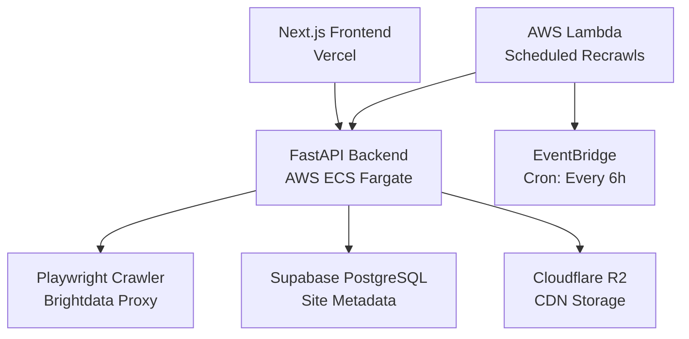

# Welcome to llms.txt Generator

A production-grade web application that automatically generates and maintains `llms.txt` files for websites by analyzing their structure and content. Built for optimal LLM understanding with real-time WebSocket streaming, scheduled updates, and enterprise-scale infrastructure.

<Note>
  Live demo available at [llmstxt.vercel.app](https://llmstxt.vercel.app)
</Note>

## What is llms.txt?

The `llms.txt` file is a standardized format (from [llmstxt.org](https://llmstxt.org)) that helps Large Language Models better understand and index website content. Think of it as a sitemap, but optimized for AI consumption.

This tool automatically:
- Crawls your website using intelligent BFS traversal
- Extracts structured content from each page
- Generates a properly formatted `llms.txt` file
- Hosts it on a CDN with scheduled auto-updates
- Keeps it synchronized with your website changes

## Key Features

<CardGroup cols={2}>
  <Card title="Intelligent Crawling" icon="spider-web">
    BFS traversal with configurable depth and page limits. Handles both static and JavaScript-rendered content via Playwright.
  </Card>
  
  <Card title="Real-time Streaming" icon="bolt">
    WebSocket-based progress updates and logs. Watch your crawl happen in real-time with detailed status messages.
  </Card>
  
  <Card title="Automated Updates" icon="clock">
    Schedule periodic recrawls via AWS Lambda + EventBridge. Your llms.txt stays synchronized with website changes automatically.
  </Card>
  
  <Card title="LLM Enhancement" icon="sparkles">
    Optional AI-powered content optimization using Grok 4.1-Fast to improve descriptions and structure.
  </Card>
  
  <Card title="Persistent Storage" icon="database">
    R2 object storage with public CDN URLs. Your generated files are hosted and accessible worldwide.
  </Card>
  
  <Card title="Spec Compliance" icon="check-circle">
    Adheres to official llmstxt.org specification with proper markdown formatting and structure.
  </Card>
</CardGroup>

## Architecture Overview

The system consists of three main components working together:

<AccordionGroup>
  <Accordion title="Frontend Layer">
    - **Next.js 15** with TypeScript
    - Real-time WebSocket client
    - Tailwind CSS for styling
    - Deployed on Vercel
  </Accordion>
  
  <Accordion title="Backend Layer">
    - **FastAPI** (Python 3.11) WebSocket API
    - Playwright for browser automation
    - BeautifulSoup4 for HTML parsing
    - Deployed on AWS ECS Fargate
  </Accordion>
  
  <Accordion title="Infrastructure Layer">
    - **Supabase** - PostgreSQL database
    - **Cloudflare R2** - Object storage & CDN
    - **AWS Lambda** - Scheduled recrawl tasks
    - **Brightdata** - Proxy for JS-heavy sites
  </Accordion>
</AccordionGroup>

## How It Works

<Steps>
  <Step title="Submit URL">
    User enters a website URL in the web interface and configures crawl parameters (max pages, description length, etc.)
  </Step>
  
  <Step title="Intelligent Crawling">
    The crawler performs BFS traversal, extracting titles, descriptions, and content from each page. Optionally uses Brightdata proxy for JavaScript-rendered content.
  </Step>
  
  <Step title="Content Formatting">
    Pages are formatted according to the llmstxt.org specification with proper markdown structure, hierarchical headings, and blockquote excerpts.
  </Step>
  
  <Step title="LLM Enhancement (Optional)">
    If enabled, the content is processed through Grok 4.1-Fast to optimize descriptions and improve structure.
  </Step>
  
  <Step title="Storage & Hosting">
    The generated `llms.txt` file is uploaded to Cloudflare R2 and a public CDN URL is returned.
  </Step>
  
  <Step title="Scheduled Updates (Optional)">
    If auto-update is enabled, the site is enrolled in the recrawl queue. AWS Lambda checks for updates every 6 hours and regenerates the file when needed.
  </Step>
</Steps>

## Use Cases

<CardGroup cols={2}>
  <Card title="Documentation Sites" icon="book">
    Make your docs easily discoverable and understandable by AI assistants and chatbots.
  </Card>
  
  <Card title="E-commerce" icon="shopping-cart">
    Help LLMs understand your product catalog, improving recommendations and search.
  </Card>
  
  <Card title="Blogs & Publications" icon="newspaper">
    Index your articles and content for better AI-powered content discovery.
  </Card>
  
  <Card title="Corporate Websites" icon="building">
    Make your services, products, and information accessible to AI tools.
  </Card>
</CardGroup>

## Tech Stack

<Tabs>
  <Tab title="Backend">
    - **FastAPI** - Modern async Python web framework
    - **Playwright** - Browser automation
    - **BeautifulSoup4** - HTML parsing
    - **Supabase** - PostgreSQL database
    - **Cloudflare R2** - Object storage
    - **Brightdata** - Proxy for JS-heavy sites
  </Tab>
  
  <Tab title="Frontend">
    - **Next.js 15** - React framework
    - **TypeScript** - Type safety
    - **Tailwind CSS** - Styling
    - **WebSocket API** - Real-time communication
  </Tab>
  
  <Tab title="Infrastructure">
    - **AWS ECS Fargate** - Container orchestration
    - **AWS ECR** - Docker registry
    - **AWS Lambda** - Scheduled tasks
    - **AWS EventBridge** - Cron scheduling
    - **Vercel** - Frontend hosting
    - **Terraform** - Infrastructure as Code
  </Tab>
</Tabs>

## What's Next?

<CardGroup cols={2}>
  <Card title="Quick Start" icon="rocket" href="/quickstart">
    Get started in 5 minutes with local development
  </Card>
  
  <Card title="API Reference" icon="code" href="/api/websocket">
    Explore the WebSocket API and endpoints
  </Card>
  
  <Card title="Deployment Guide" icon="cloud" href="/deployment/overview">
    Deploy to AWS with Terraform
  </Card>
  
  <Card title="Configuration" icon="gear" href="/guides/configuration">
    Configure environment variables and settings
  </Card>
</CardGroup>

## Community & Support

<Card title="Open Source" icon="github">
  This project is open source and available on GitHub. Contributions, issues, and feature requests are welcome!
</Card>

<Warning>
  This tool crawls websites and may generate significant traffic. Always respect robots.txt and rate limits. Use the Brightdata proxy feature for production crawling.
</Warning>